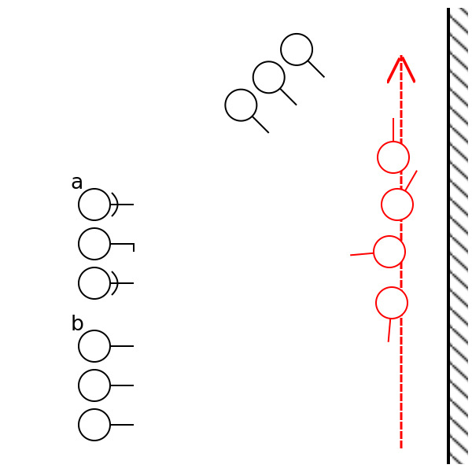

<!-- .margin.compass -->
* _Extras_
* Troll Tactics
* **Goblin Tecs**
* Tables

# Goblin Techniques

Patterns used by humans and humanoids. [^1]

## Signals

Elder wood whistle, drum, horn.

## Ambush

</img>

<!-- <div.tech.ambush> -->
Nada
<!-- 
 -->

## Movement

## Defense Line

## Raid

[^1]:
  

    

      </img>
      
archer

    

    

      </img>
      
spearman

    

    

      </img>
      
leader

    

  

